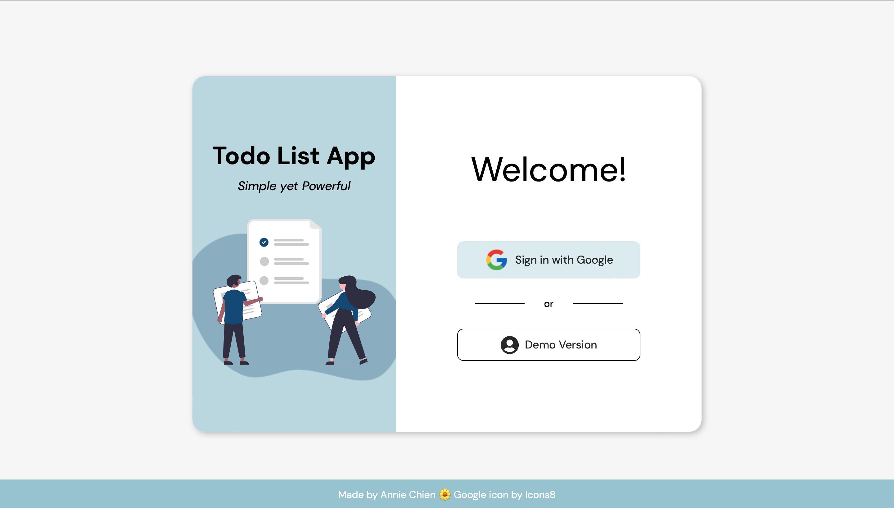
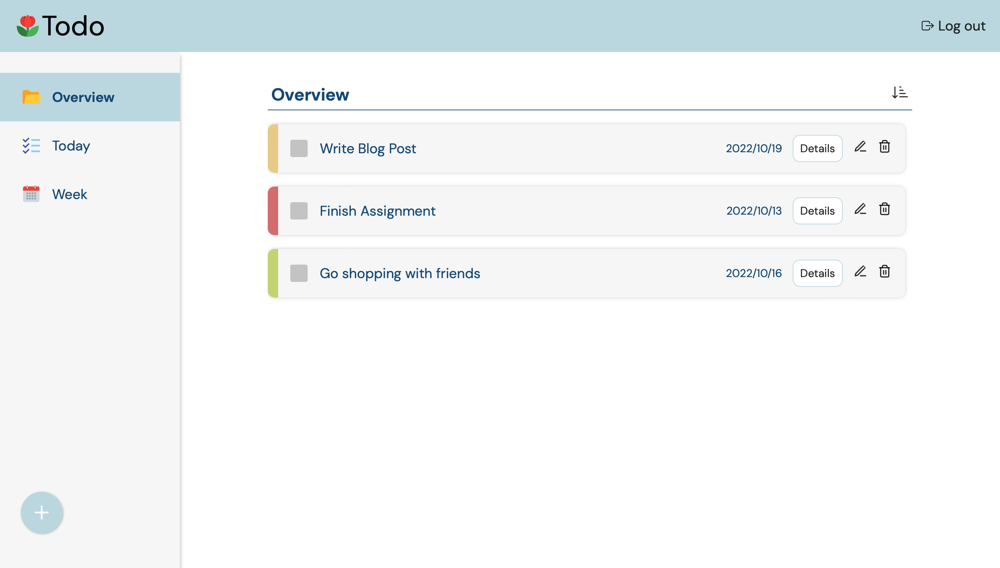

# Todo-List

實作有登入功能的 Todo List，並使用 Firebase 的 Realtime Database 來儲存資料。

🚪 [Live](https://simeple-todo-list.netlify.app)

## Overview

【登入頁】

✒︎ 有兩種登入方式：

1. Google 登入
2. Demo version

❗️Demo version 裡的資料是共享的，任何透過 Demo version 進入的人都可以檢視及編輯同一份資料。

【首頁】

✒︎ 功能：

1. 新增任務：標題（必填）、期限（預設值為今日）、細節、重要性（預設值為 low）
2. 刪除特定任務
3. 編輯特定任務
4. 側邊選單：Overview（總覽）/ Today (期限為今日的任務) / Week (期限為當週的任務)
5. 排序按鈕：依據期限，從近到遠排序任務

## 使用的技術

- React, React Router
- CSS Modules, SASS
- Firebase

## Resources

登入頁的插圖取自 [unDraw](https://undraw.co)
Google icon by [Icons8](https://icons8.com/icon/V5cGWnc9R4xj/google)
